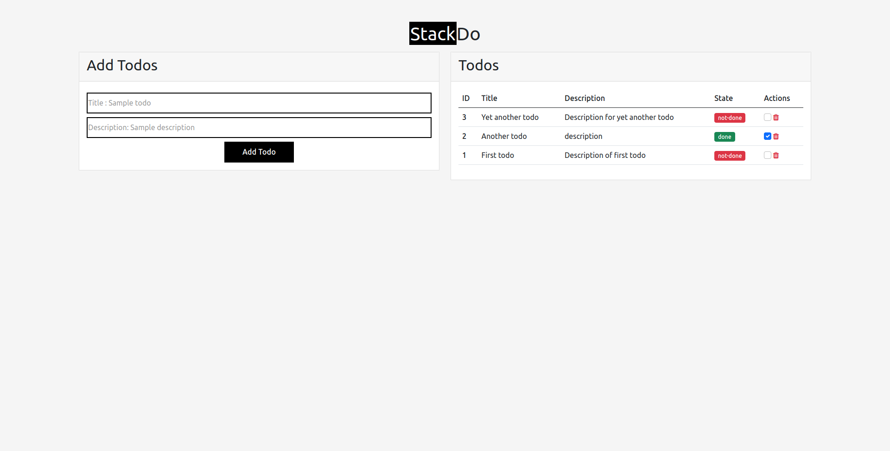
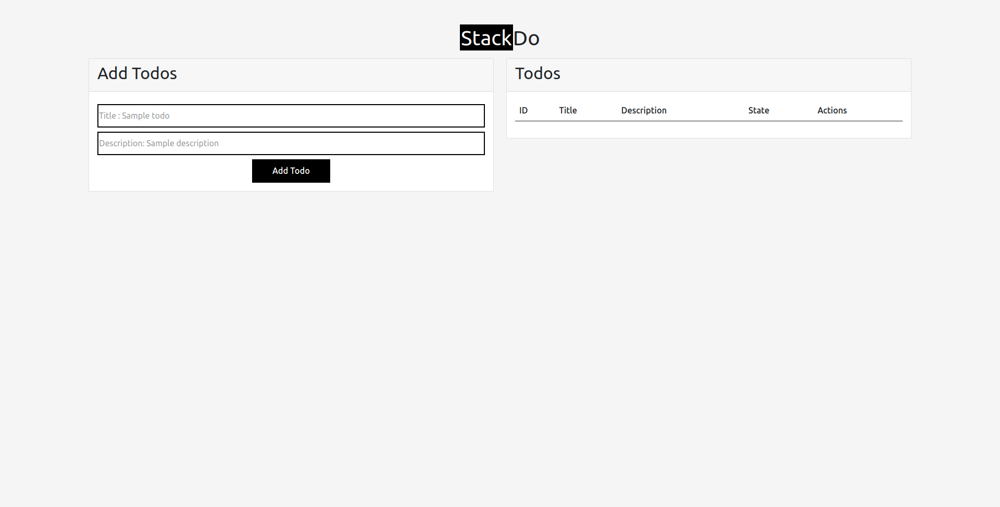
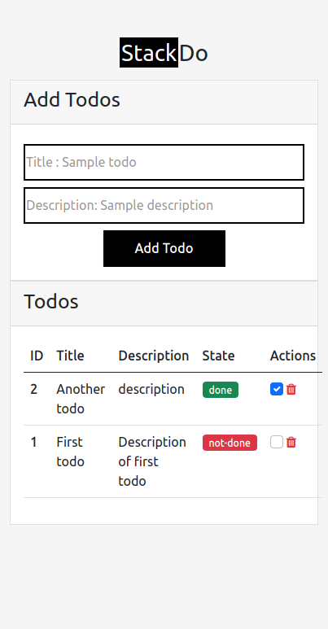
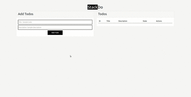

# StackDo 

Super simple **reactive** todo app ui constructed in plain javascript(HTML + Bootstrap 5 + CSS).

## Watch [Build Todo App in Vanilla JS: Super simple Implementation.]()


## Screenshots

### Loaded view



### Empty view



#### Mobile view




## Animated GIF



## Docs

### 1. Make sure page is loaded before running javascript

```js
window.addEventListener('DOMContentLoaded', function () { });
```

### 2. Caputing Dom Elements

```js
    let addTodo = document.getElementById('add-todo');
    let todoTitle = document.getElementById('todo-title');
    let todoDescription = document.getElementById('todo-description');
    let table = document.getElementById('todo-table');
    let errorAlert = document.getElementById('error-alert');
```

### 3. Add data structure to "store" todos

```js
 let todoList = new Map();
 ```

 ### 4. `addEventListener` for `addTodo`

 ```js

    addTodo.addEventListener('click', function (event) {
        event.preventDefault();
        let todo = {
            title: todoTitle.value,
            description: todoDescription.value,
            done: false
        }
        if (todo.title) {
            let id = todoList.size + 1;
            todo.id = id;
            todoList.set(id, todo)
            todoTitle.value = ''
            todoDescription.value = ''
            updateTable();
        } else {
            errorAlert.innerText = 'At least a todo title is required';
            errorAlert.style.display = 'block';
            setTimeout(() => errorAlert.style.display = 'none', 3000);
        }
    });
```

### 5. Event Delegation for `delete` and `mark-as-done`

```js
    document.addEventListener('click', function(event) {
        if(Array.from(event.target.classList).includes('fa-trash')) {
            let delete_id = Number(event.target.closest('.delete-button').dataset.id);
            todoList.delete(delete_id);
            updateTable();
        }

        if(Array.from(event.target.classList).includes('form-check-input')) {
            let checked_id = Number(event.target.dataset.id);
            let todo = todoList.get(checked_id);
            todo.done = event.target.checked;
            todoList.set(checked_id, todo);
            updateTable();
        }
    });
```


### 6. "Surgically" update table DOM!

```js
    let updateTable = () => {
        while(table.firstElementChild) table.firstElementChild.parentNode.removeChild(table.firstElementChild);
        let rows = '';
        let todos = Array.from(todoList.values());
        todos.reverse();
        todos.forEach((todo) => {
            let done = todo.done ? `<span class="badge bg-success">done</span>` : `<span class="badge bg-danger">not-done</span>`;
            let checked = todo.done ? `<input type="checkbox" data-id="${todo.id}" checked class="form-check-input"></input>`:`<input type="checkbox" data-id="${todo.id}" class="form-check-input"></input>`;
            rows += `
            <tr>
            <th scope="row">${todo.id}</th>
            <td>${todo.title}</td>
            <td>${todo.description}</td>
            <td>
                ${done}
            </td>
            <td>
                ${checked}
                <span class="text-danger delete-button" data-id="${todo.id}"><i class="fa fa-trash"></i></span>
            </td>
          </tr>
            `
        });

        table.innerHTML = rows;
    }
```